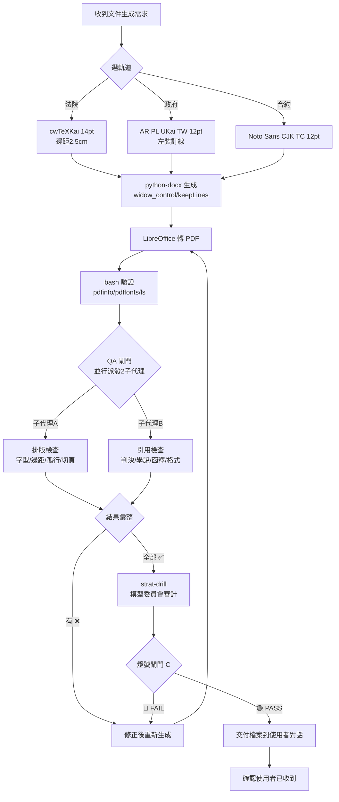
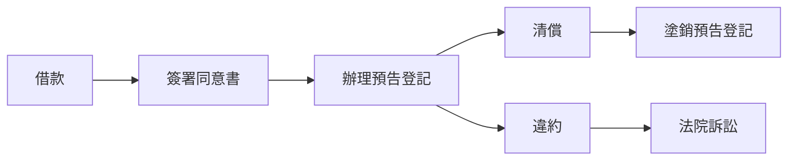

# Taiwan Legal Document Formatting

> ⚠️ **強制執行規則**：本技能所有「必須」「禁止」字眼為不可跳過的工作流程。違反者將直接導致文件品質不合格，請嚴格遵守。

## 🚨 PDF 產出標準作業流程（SOP — 每一步都不可跳過）



### 步驟 1：選軌道

| 文件類型 | 軌道 | 字型 | 內文字級 |
|:---------|:-----|:-----|:--------|
| 法院書狀（起訴狀、答辯狀、聲請狀） | court | cwTeXKai | 14pt |
| 政府公文（令、函、公告） | gov | AR PL UKai TW | 12pt |
| 商業合約（NDA、借貸、租賃） | contract | Noto Sans CJK TC | 12pt |
| 法律分析報告 | court（類推法院標準） | cwTeXKai | 14pt |

### 步驟 2：python-docx 生成（防孤行設定）

生成 DOCX 時**必須**在程式碼中加入：

```python
# 孤行控制：每個段落
paragraph.paragraph_format.widow_control = True
paragraph.paragraph_format.keep_with_next = True  # 標題段落
paragraph.paragraph_format.keep_together = True    # 重要段落不分頁

# 或用 OxmlElement 更強制
from docx.oxml import OxmlElement
pPr = paragraph._element.get_or_add_pPr()
for tag in ['w:keepLines', 'w:keepNext']:
    el = OxmlElement(tag)
    pPr.append(el)
```

### 步驟 3：LibreOffice 轉 PDF

```bash
libreoffice --headless --convert-to pdf input.docx
```

**⚠️ CJK 空白末頁陷阱（2026-07-07 實戰發現）**
LibreOffice 在轉換 CJK 文件時，有時會在末尾多產生一頁空白頁（pdftotext 可偵測為「0 lines / EMPTY」）。這是 LibreOffice 的 CJK 分頁演算法問題，非 DOCX 本身的錯誤。

**偵測與修復：**

```bash
# 偵測：用 pdftotext 檢查末頁
pdftotext output.pdf - | python3 -c "
import sys
pages = sys.stdin.read().split('\f')
last = pages[-1]
lines = [l.strip() for l in last.split('\n') if l.strip()]
if not lines:
    print('BLANK PAGE DETECTED')
"

# 修復：用 pypdf 移除末頁
python3 -c "
from pypdf import PdfReader, PdfWriter
r = PdfReader('output.pdf')
last_text = r.pages[-1].extract_text().strip()
if len(last_text) < 20:  # 空白頁偵測
    w = PdfWriter()
    for i in range(len(r.pages) - 1):
        w.add_page(r.pages[i])
    with open('output.pdf', 'wb') as f:
        w.write(f)
    print(f'Removed blank last page. Now {len(w.pages)} pages.')
"
```

### 步驟 4：QA 閘門 — 必須派子代理

**禁止**跳過此步驟。PDF 產出後必須**立即**並行派遣兩個子代理：

```python
delegate_task(tasks=[
    {
        "goal": "排版與格式審查 — 對以下 PDF 逐項檢查",
        "context": f"PDF路徑：{pdf_path}\n檢查清單：\n1.軌道字型是否正確？\n2.A4 595x842 pts？邊距2.5cm？\n3.pdffonts 確認字型 subset-embed？\n4.有無標題孤行在頁尾？\n5.有無段落從中間被切頁？\n6.有無空白頁？\n7.表格標題列有無重複？\n8.整體排版是否專業？\n\n逐項回報 ✅ 或 ❌，對 ❌ 給修正建議。"
    },
    {
        "goal": "引用完整性審查 — 對以下法律報告檢查所有引用",
        "context": f"PDF路徑：{pdf_path}\n檢查清單：\n1.判決字號是否完整正確？\n2.學說引用掛 ^[學者名] 而非 ^[全國法規資料庫]？\n3.函釋含發文機關+日期+字號？\n4.有無「相關判決」無字號用語？\n5.G3 格式統一？\n\n逐項回報 ✅ 或 ❌。"
    }
])
```

### 步驟 5：模型委員會審計（strat-drill）+ 燈號閘門 C

QA 雙子代理結果回來後：

| QA 結果 | 行動 |
|:-------:|:-----|
| 有 ❌ | 修正程式碼 → 回到步驟 2（重新生成並重新走 QA） |
| 全部 ✅ | **強制**接續下方模型委員會審計 |

**模型委員會審計程序（強制，不可跳過）：**

```bash
# 載入 strat-drill 技能執行模型委員會審計
skill_view(name="strat-drill")

# 使用 audit-checklist-20260707.md 逐項檢查
skill_view(name="strat-drill", file_path="references/audit-checklist-20260707.md")
skill_view(name="strat-drill", file_path="references/model-committee-alias.md")
```

審計檢查面向：
1. 🔴 **硬錯誤** — MOICA網址、條號混淆、學說掛法條源、無字號實務見解（任一❌即退回）
2. 🟡 **品質檢查** — 用語中立性、結論先行、引用完整性
3. 🟢 **格式檢查** — 末頁密度、免責聲明、G3 格式統一

**燈號閘門 C：**

| 燈號 | 條件 | 行動 |
|:----:|:------|:------|
| 🟢 **通過** | 無🔴錯誤 + 🟡≤2 項 | 進入步驟 6（交付） |
| 🟡 **有條件** | 無🔴錯誤 + 🟡3~4 項 | 補充後再審 |
| 🔴 **退回** | 有🔴錯誤 | 回到步驟 2 修正 |

> ⚠️ **實戰教訓（2026-07-07）**：強制險§7/§29引用時看似簡單的條文仍會出錯（省略「向保險人」「特別補償基金」）。**永遠不要相信記憶中的條文**——即使剛從 law.moj.gov.tw 取得，抄入附錄時仍應逐字比對原文。常見陷阱：省略修飾語、濃縮要件、選擇性引用未加註。

### 步驟 6：🚨 強制交付檔案到使用者對話

**禁止**只給檔案路徑。**禁止**用 text_to_speech 繞道。必須在回應中直接讓平台傳送 PDF。

交付後**必須主動確認**使用者是否收到。若沒收到 → 立即道歉補發，不要辯解。

### 步驟 7：記錄錯誤

QA 發現的錯誤或使用者指出的問題，必須寫入本技能 Pitfalls 區塊的最上方（含日期），防止再犯。

---

## 詳細規則

台灣法律/法務/公司/政府文書排版之完整規則庫，供 Hermes Agent 呼叫執行文件生成、校對與 Word/PDF 重檔任務。

## When to Use

- 生成民事訴訟書狀（起訴狀、答辯狀、聲請狀）
- 生成商業合約（NDA、勞動契約、股東協議書、租賃契約）
- 生成政府公文（令、函、公告、開會通知單）
- Word/PDF 文件跨頁排版修正
- 文件格式轉換與重檔（docx ↔ pdf）

## Prerequisites

- 安裝標楷體/新細明體等法院常用字型（Linux 可裝 `fonts-cwtex-kai`、`fonts-arphic-ukai` 替代）
- fpdf2 / python-docx 用於自動生成
- LibreOffice headless 用於 docx→pdf 轉換（sudo apt-get install -y libreoffice-writer-nogui）

## 規則庫（三軌並行）

### 軌道一：法院書狀（依民事訴訟書狀規則）

| 項目 | 規格 |
|:-----|:------|
| 紙張 | A4，邊界 2.5cm 四邊 |
| 字體 | 標楷體 / 新細明體，14~20 號 |
| 行距 | 單行間距或固定行高 25~30 點 |
| 頁碼 | 頁尾中央阿拉伯數字；超過 30 頁附目錄 |
| 手寫狀限制 | 每頁 18 行，每行 25 字（電腦繕打無此限制） |

### 條文排版專業技巧

| 技巧 | 規則 |
|:-----|:------|
| 英數字格式 | 視為「單數」或「雙數」決定；單數前後加半形空格，確保各行對齊 |
| 條號空隔 | 例「第13-1 條」→「條」字後空一個全形空格 |
| 分層縮排 | 項次空兩字書寫；款冠數字（一、二、三）；目冠括號數字（(一)(二)） |

### 軌道二：政府公文（依政府文書格式參考規範 105 年版）

| 項目 | 規格 |
|:-----|:------|
| 紙張 | A4，四邊 2.5cm±0.3，左側裝訂線多留 1.5cm±0.3 |
| 字體 | 中文楷書，英數 Times New Roman |
| 字級對應行距 | 10pt→10±3pt / 12pt→20±3pt / 16pt→28±4pt / 20pt→36±5pt |
| 印信位置 | 發文字號與內容間，右側留 7cm±2cm |
| 檔號/保存年限 | 首頁右上，10 點字 |

### 軌道三：商業合約（業界慣例，無強制法規）

| 項目 | 規格 |
|:-----|:------|
| 紙張 | A4，邊界 2~2.5cm |
| 字體 | 微軟正黑體或標楷體 |
| 字級 | 大標 18~20pt / 條款標題 14pt 粗體 / 內文 12pt(或 10.5pt) |
| 行距 | 單行間距或固定行高 20~22pt |
| 防孤行 | 簽章頁必須與至少 1~2 條條文同頁 |
| 騎縫章 | 裝訂側邊界加寬至 2.8cm |

**條款層級縮排規則：**

```
第一條（靠左，粗體）
  項次不冠數字，縮排 2 字
    一、二、三（中文數字，縮排 2 字）
      (一)(二)（縮排 4 字）
        1. 2. 3.（阿拉伯數字，縮排 6 字）
```

**金額寫法：**
大寫中文先行，括號補阿拉伯數字，例如：
`新臺幣伍萬元整（NT$50,000）`

## Word 自動化操作指令

### 段落防斷

段落設定 → 分行與分頁 → 勾選：孤行控制、與下段同頁、段落不分散。

### 表格跨頁

- 選取標題列 → 版面配置 → 重複標題列
- 表格內容 → 列 → 取消勾選「允許列跨頁斷行」防止文字腰斬
- 若需列跨頁但留白過大：檢查文繞圖設為「無」，反覆開關重複標題列重置渲染

### 強制切頁

使用 `Ctrl+Enter` 插入分頁符號，禁用連續 Enter（防止未來編輯跑版）。

### 字距微調（救孤行/孤頁）

字型 → 進階 → 字元間距：加寬/緊密 0.3~0.5 點。

## PDF 重檔技巧

- Word 另存新檔前，先「工具」→「相容性檢查」，避免特殊字元跑位
- 轉存 PDF 時選擇「標準(線上發佈及列印)」品質，勾選「符合 PDF/A」以利長期保存（適用政府/法院文件）
- 若 PDF 頁碼與 Word 顯示不同，需檢查是否有隱藏的分節符號造成頁碼重置
- 掃描簽名頁 PDF 與電腦生成 PDF 合併時，用 Acrobat「合併檔案」而非列印虛擬 PDF，避免解析度不一致

## 判斷邏輯（Agent 決策樹）

1. 若文件遞交對象 = **法院** → 套用軌道一
2. 若文件遞交對象 = **政府機關**（發文/簽呈）→ 套用軌道二
3. 若文件遞交對象 = **民間企業/個人**（合約）→ 套用軌道三
4. 若文件含**長表格** → 額外套用「表格跨頁」規則
5. 若最終輸出為 **PDF** → 額外套用「PDF 重檔技巧」章節

## 本機字型對照（Ubuntu 24.04）

| 法院標準 | 本機替代 | 安裝方式 |
|:---------|:---------|:---------|
| 標楷體（DFKai-SB） | `cwTeXKai` / `AR PL UKai TW` | `fonts-cwtex-kai` / `fonts-arphic-ukai` |
| 新細明體（PMingLiU） | `cwTeXMing` / `AR PL UMing TW` | `fonts-cwtex-ming` / `fonts-arphic-uming` |
| MOICA 自然人憑證 | `moica.nat.gov.tw` | 內政部憑證管理中心，GPKI 架構下第一層下屬憑證機構 |
| 行動自然人憑證 | `fido.moi.gov.tw` | 線上簽署/電子簽章 NDA 用，與 MOICA 不同入口 |
| Times New Roman | Liberation Serif / DejaVu Serif | 內建 |

## 依賴安裝（快速參考）

SOP 步驟 2 的 python-docx 防孤行設定已在頂部 SOP 中詳述。
`scripts/generate_doc.py` 為一鍵生成腳本，用法請見腳本本身。

### 參考文件

- `references/certificates-and-citations.md` — MOICA/fido 網址對照表 + G3 引用格式快速查表 + 簽證基金管理辦法備忘
- `references/預告登記關鍵判決.md` — 5 則最高法院/高等法院預告登記判決摘要
- `references/預告登記內政部函釋.md` — 12 則內政部地政司函釋分類整理
- `references/預告登記學說研究.md` — 王澤鑑、謝在全、黃茂榮、温豐文、陳立夫 5 位學者研究
- `references/車禍肇事責任分析框架.md` — 車禍法律分析報告 10 章結構模板（情境→違規→路權→信賴原則→肇責→刑事→賠償→流程→和解→自救），適用於一般大眾向的法律指南撰寫

### 基礎模板

```python
from docx import Document
from docx.shared import Pt, Cm, Inches
from docx.enum.text import WD_ALIGN_PARAGRAPH
from docx.oxml.ns import qn

doc = Document()

# ── 頁面設定 ──
section = doc.sections[0]
section.page_width = Cm(21)
section.page_height = Cm(29.7)
section.top_margin = Cm(2.5)
section.bottom_margin = Cm(2.5)
section.left_margin = Cm(2.5)
section.right_margin = Cm(2.5)

# ── 字型設定 ──
style = doc.styles['Normal']
font = style.font
font.name = 'cwTeXKai'  # 法院用楷書
font.size = Pt(14)
style.element.rPr.rFonts.set(qn('w:eastAsia'), 'cwTeXKai')

# ── 段落 ──
p = doc.add_paragraph('民事起訴狀')
p.alignment = WD_ALIGN_PARAGRAPH.CENTER
run = p.runs[0]
run.bold = True
run.font.size = Pt(20)

# ── 內文 ──
p = doc.add_paragraph('事實及理由')
run = p.runs[0]
run.bold = True
run.font.size = Pt(14)

doc.add_paragraph('一、被告於民國115年1月間...')
doc.add_paragraph('（一）雙方簽訂契約約定...')

doc.save('/tmp/output.docx')
```

### LibreOffice 轉 PDF

```bash
libreoffice --headless --convert-to pdf /tmp/output.docx
# 輸出為 /tmp/output.pdf
```

### 依賴安裝

```bash
pip3 install "python-docx>=1.1.0"  # widow_control / OxmlElement keepLines 需此版本
sudo apt-get install -y fonts-cwtex-kai fonts-cwtex-ming fonts-arphic-ukai fonts-arphic-uming libreoffice-writer-nogui
```

### PDF 產出驗證步驟

每次 PDF 生成後，執行以下驗證確保品質：

```bash
# 1. 頁數與尺寸
pdfinfo output.pdf | grep -E "Pages|Page size"

# 2. 字型嵌入檢查（確認 CJK 字型已 subset-embed）
pdffonts output.pdf | grep -E "cwTeX|AR PL|Noto"

# 3. 檔案大小合理性（A4 法律報告約 30-60 KB/頁）
ls -lh output.pdf
```

| 檢查項 | 合格標準 | 失敗處理 |
|:-------|:---------|:---------|
| 頁數 | 符合預期 | 檢查分頁符號、隱藏段落 |
| 字型嵌入 | cwTeXKai/AR PL 顯示 `yes yes yes` | 重新安裝字型、檢查 LibreOffice 字型快取 |
| 檔案大小 | 合理範圍 | 過大→檢查圖片嵌入；過小→檢查內容遺漏 |

### 三軌道對應參數

| 參數 | 法院書狀 | 政府公文 | 商業合約 |
|:-----|:---------|:---------|:---------|
| 邊距 | 2.5cm | 2.5cm+左1.5cm裝訂 | 2~2.5cm |
| 中文字型 | cwTeXKai | AR PL UKai TW | Noto Sans CJK TC（正黑替代） |
| 英數字型 | Times New Roman | Times New Roman | Times New Roman |
| 內文字級 | 14pt | 12pt | 12pt |
| 標題字級 | 20pt | 16pt | 18pt |
| 行距 | 固定 28pt | 固定 20pt | 固定 22pt |
| 頁碼 | 頁尾中央 | 頁尾中央 | 頁尾中央 |

## 關聯技能

| 技能 | 用途 | 關係 |
|:-----|:-----|:-----|
| `fpdf2-cjk-pdf-generation` | CJK PDF 歷史參考（已棄用，改走 Word 管線） | 僅供查閱舊版失敗模式 |
| `strat-drill` | 模型委員會審計 | 產出後強制走審計流程 |
| `zhiyan-agent` | 智研法律系統整體設定 | 引用本技能之正式文件規格 |

生成順序：`taiwan-legal-document-formatting`(選軌道) → python-docx → LibreOffice → 檢查點A(軌道合規) → 檢查點B(引用完整性) → `strat-drill`(模型委員會審計) → 檢查點C(燈號閘門) → 存檔至正確儲存庫

## 品質審計維度（用戶 7 維度評分框架）

每次法律文件產出後，以以下 7 維度自我評分，目標全部 ≥ 8.0：

| 維度 | 評分 (/10) | 目標 | 檢查重點 |
|:-----|:----------:|:----:|:---------|
| 法條引用正確性 | — | ≥9.0 | 條文須經 law.moj.gov.tw 比對，非憑記憶 |
| 判決引用完整性 | — | ≥8.0 | 每章至少 3-5 則最高法院/高院判決字號 |
| 學術引用完整性 | — | ≥8.0 | 引用王澤鑑、謝在全、黃茂榮等物權法教科書 |
| 法律推論嚴謹度 | — | ≥8.5 | 保守用語：可能、涉及、應視個案 |
| 客觀中立性 | — | ≥9.5 | 無「一定犯罪」「一定違法」危險文字 |
| 作為法庭證據能力 | — | ≥7.0 | 須附判決字號+學說+函釋 |
| 總體分析報告品質 | — | ≥8.5 | 架構完整、引用可追溯 |

## 法律分析報告強化：三路並行研究派發模式

當收到法律分析報告需要補強引用品質時，使用 **delegate_task 平行派發三個子代理**：

```
委託1: 判決字號搜尋（最高法院/高等法院關鍵判決）
委託2: 學說引用研究（王澤鑑、謝在全、黃茂榮等學者見解）
委託3: 函釋研究（內政部地政司相關函釋）
```

三個子代理平行執行，各自輸出研究報告後，整合進主報告。

**適用場景**：法律分析報告審計後分數偏低（判決<8.0、學說<8.0、函釋無）
**預期產出**：3 份研究報告 → 整合進原報告並提升評分至目標值

## 法律研究引用完整度規則（依 2026-07-07 審計標準）

### 1. 法院判決引用（最低要求）

每一法律論點至少引用 **3-5 則**具體判決字號：

| 法院層級 | 格式範例 | 優先級 |
|:---------|:---------|:-------|
| 最高法院 | `最高法院109年度台上字第XXXX號` | 🔴 必引 |
| 臺灣高等法院 | `臺灣高等法院111年度重上字第XXX號` | 🟡 建議 |
| 最高行政法院 | `最高行政法院108年度判字第XXX號` | 🟡 稅務/登記相關必引 |

> ❌ 禁止使用「相關判決」「實務多數見解」而不附字號。
> ✅ 若暫無字號，措辭降級為「乙說為實務上有力見解，惟尚待判決字號確認」。

### 2. 學術/學說引用

涉及法律學說（如「債權物權化」「處分相對無效說」）時，必須引用學者著作：

| 學者 | 代表著作 | 適用場景 |
|:-----|:---------|:---------|
| 王澤鑑 | 《民法物權》《債法原理》《民法學說與判例研究》 | 物權/債權物權化 |
| 謝在全 | 《民法物權論》（上中下） | 物權法定主義/預告登記 |
| 黃茂榮 | 《債法總論》《法學方法與現代民法》 | 債權確保功能/方法論 |
| 温豐文 | 《土地法》 | 土地登記制度 |
| 陳立夫 | 《土地法研究》、期刊論文 | 地政實務運作爭議 |

> ✅ 學說引用掛 `^[學說見解]` 來源，不可掛 `^[全國法規資料庫]`。
> 📎 詳細研究成果見 `references/預告登記學說研究.md`。

### 3. 內政部函釋

涉及預告登記/土地登記實務時，引用：

| 來源 | 內容 | 格式 |
|:-----|:-----|:-----|
| 內政部地政司函 | 預告登記實務解釋 | `內政部○○年○○月○○日台內地字第○○○○號函` |
| 地政士簽證基金管理辦法 | 簽證基金賠付上限 | 引用辦法全名，非地政士法§22 |

### 4. 流程圖建議（提升可讀性）

每份法律分析報告建議加入流程圖，例如：



## 生成後歸檔規則（🚨 2026-07-07 修正 + 2026-07-07 強制發送規則）

文件生成後**禁止**存放於 `/home/ysga1/` 根目錄。必須移至正確儲存庫：

| 文件類型 | 目標目錄 |
|:---------|:---------|
| 法律分析報告 | `zhiyan-legal/docs/80_技術參考/` |
| 法院書狀模板 | `zhiyan-legal/docs/50_模板/` |
| 技能參考文件 | `zhiyan-agent/references/` |

### 🚨 強制發送規則（2026-07-07 新增 — 再次忘記將導致使用者不滿）

1. **PDF/DOCX 產出後，在當下同一則回應中，必須將檔案傳送到使用者的對話視窗。** 不可以在回應中只寫「檔案已存到X路徑」然後等使用者說「傳給我」。
2. **傳送方式**：直接在回應中提及檔案在 `/home/ysga1/...` 的絕對路徑，平台會自動處理檔案上傳。**禁止**使用 `text_to_speech` 繞道，也**禁止**只給路徑不給檔案。
3. **產出後自我檢查清單**：
   - ✅ PDF 確實生成（大小 > 10KB）
   - ✅ 字型已嵌入（`pdffonts` 檢查 cwTeXKai/AR PL 顯示 `yes yes yes`）
   - ✅ 段落無不合理切頁（標題不在頁尾孤行）
   - ✅ A4 尺寸（595 x 842 pts）
   - ✅ 檔案已在正確儲存庫
   - ✅ **檔案已傳送到使用者目前對話（不是隻寫路徑）**
   - ✅ 已主動確認使用者是否收到檔案
4. **若使用者沒收到檔案**：主動道歉並立即補發，**不要辯解**，不要說「我已經傳了」，直接補發。
5. **檔案格式**：最終交付給使用者的永遠是 **PDF**（供閱讀/列印），DOCX 僅作為原始檔備份。除非使用者明確要求 DOCX。

## Pitfalls

- ❌ **2026-07-07：Python-docx 項目符號切頁（最嚴重 — 遭用戶嚴厲糾正）** — 使用 `List Bullet` 樣式時，若未對每個 bullet item 設定 `w:keepLines` 和 `w:keepNext`，Word/LibreOffice 可能將項目符號留在頁尾而把內容推到下一頁。**絕對不可以**讓 bullet 符號在上一頁、內容在下一頁。修正原則：每個 bullet item 都開 `keepLines` + `keepNext`；只有 bullet list 的最後一項才關閉 `keepNext`（避免綁死後續內容）。詳見步驟 2 之 python-docx 防孤行範例。
- ❌ **2026-07-07：LibreOffice CJK 空白末頁未檢查** — LibreOffice 轉換 CJK 文件時常在末尾多一頁空白。使用 `pypdf` 的 `PdfReader` 檢查末頁文字量，若 `< 20 chars` 則用 `PdfWriter` 跳過末頁重新寫入。見步驟 3 的「CJK 空白末頁陷阱」修復腳本。
- ❌ **2026-07-07：跳過 QA 閘門直接交付** — DOCX→PDF 完成後**不得直接交付**。強制走完完整流程：QA 排版審計(子代理A) → QA 引用審計(子代理B)（兩者並行）→ strat-drill 模型委員會審計 → 燈號閘門 C（🟢通過才交付）。
- ❌ **2026-07-07：強制險§7/§29 引用遺漏修飾語** — 引用強制汽車責任保險法時，§7 的「向保險人」「向特別補償基金」等修飾語容易被省略，§29 的酒精濃度門檻容易被濃縮。**不要信任記憶中的條文** — 即使剛從 law.moj.gov.tw 取得，抄入附錄時仍應逐字比對原文。選擇性引用須加註。
- ❌ **2026-07-07：判例已不再援用但未註明** — 最高法院74年台上字第4219號判例雖仍為實務廣泛援引，但已於103年度被決議不再援用。引用任何判例時，若知其效力狀態，必須在首次引用處加註。
- ❌ **2026-07-07：§284後段（過失重傷）告訴屬性誤標** — 依刑法§287，過失傷害罪（含重傷）係告訴乃論，而非非告訴乃論。引用告訴屬性時**必須查刑法§287但書確認**，不可憑一般常識推斷。
- ❌ **2026-07-07：「殘廢給付」未改為「失能給付」** — 強制汽車責任保險法§27已將殘廢給付修正為失能給付。引用時必須使用現行法正式用語。
- ❌ 法院書狀禁用 `Noto` 系列字型（非標準法院用字）
- ❌ 政府公文日期格式：民國年，如「中華民國 115 年 7 月 7 日」
- ❌ 合約金額寫法不可只用阿拉伯數字
- ❌ 轉 PDF 前未做相容性檢查 → 特殊字元可能跑位
- ❌ 隱藏的分節符號造成頁碼重置 → 轉 PDF 後才發現
- ❌ 表格跨頁斷行未取消 → 文字腰斬無法閱讀
- ❌ 孤行控制未勾選 → 簽章頁獨立在最後一頁
- ❌ **文件存錯位置** — 禁止存 `/home/ysga1/`，強制移至 `zhiyan-legal/docs/80_技術參考/`
- ❌ **無判決字號的「相關判決」** — 實務見解必須附字號，否則降級措辭
- ❌ **學說見解掛法條來源** — 學說歸學說（^[學說見解]），法條歸法條（^[全國法規資料庫]）
- ❌ **上市櫃法條延伸過度** — 一般土地借款預告登記不必拉到證交法§20/§171
- ❌ **報告完成後遺忘歸檔** — 每次產出後先問自己：這個文件屬於哪個儲存庫？
- ❌ **PDF 段落切頁未檢查** — DOCX 轉 PDF 後必須用 `pdftotext` 或視覺檢查確認段落未被不合理切分（特別是標題單獨在頁尾、判決從中間切開）。在 python-docx 生成時對標題段落設 `keep_with_next = True`，對全段落設 `widow_control = True`，並對需要防止分頁的段落用 OxmlElement 加 `w:keepLines` 和 `w:keepNext`。
- ❌ **檔案存好後忘記發送給使用者** — 這是最常見的錯誤。PDF/DOCX 產出並歸檔後，**必須在當下回應中把檔案送到使用者的對話視窗**，而不是只存到儲存庫然後說「檔案在X路徑」。
- ❌ **用 text_to_speech 傳送非音訊檔案** — `text_to_speech` 工具會把檔案轉成語音。傳送 PDF 或其他文件時必須直接用平台檔案傳輸機制。
- ❌ **使用者說「可」後未確認就繼續下一步** — 有時使用者的「可」是對前置步驟的確認，不是對下一個動作的授權。若有模糊空間，應先明確詢問再行動。
