# Media Pipeline v3.0 — FEG + State Machine + Hooks 閉環

> 自動化影片流水線，以 Finite Execution Graph (FEG) 定義流程、State Machine 管理每個節點的狀態、Hooks 串接品質閘門與自我修正。

把「一個主題」轉成「一部完整影片」。三步生產線，無需手動介入。

## Architecture

```dot
digraph FEG_MediaPipeline {
    rankdir=LR;
    node [shape=box, style=rounded];

    START [label="Start", shape=ellipse, style=filled, fillcolor=lightgreen];
    END   [label="Deliver", shape=ellipse, style=filled, fillcolor=lightblue];

    START -> S0_SCRIPT [label="主題輸入"];
    
    S0_SCRIPT [label="S0: 腳本編譯\n(writer-compiler)"];
    S0_SCRIPT -> S0_CHECK [label="Hook: 腳本品質閘門"];
    S0_CHECK  [label="場景數≥1?\n預算夠?"];
    S0_CHECK -> S1_IMAGE     [label="✅ 通過"];
    S0_CHECK -> S0_SCRIPT    [label="❌ 重新編譯"];
    
    subgraph cluster_per_scene {
        label="每場景獨立執行 (N 次)";
        
        S1_IMAGE   [label="S1: 文生圖\n(Agnes Image 2.1 Flash)"];
        S1_IMAGE -> S1_CHECK  [label="Hook: 圖片驗證"];
        S1_CHECK  [label="URL有效?\n風格一致?"];
        S1_CHECK -> S2_VIDEO  [label="✅"];
        S1_CHECK -> S1_RETRY  [label="❌ 重試≤3次"];
        S1_RETRY  [label="S1 重試\n(retry_count++)"];
        S1_RETRY  -> S1_IMAGE;
        S1_RETRY  -> S1_SKIP  [label="≥3次 → 跳過"];
        S1_SKIP   [label="S1 跳過場景"];
        
        S2_VIDEO   [label="S2: 圖生影\n(Agnes Video V2.0)"];
        S2_VIDEO -> S2_POLL   [label="任務建立"];
        S2_POLL   [label="輪詢渲染狀態"];
        S2_POLL -> S2_CHECK   [label="✅ completed"];
        S2_POLL -> S2_POLL    [label="⏳ rendering..."];
        S2_POLL -> S2_RETRY   [label="❌ failed/timeout"];
        S2_RETRY  [label="S2 重試\n(retry_count++)"];
        S2_RETRY  -> S2_VIDEO;
        S2_RETRY  -> S1_SKIP  [label="≥3次 → 跳過"];
        
        S2_CHECK  [label="Hook: 影片品質\n檔案>0? 時長對?"];
        S2_CHECK -> S3_DL     [label="✅"];
        S2_CHECK -> S2_RETRY  [label="❌"];
        
        S3_DL     [label="S3: 下載\n儲存 MP4"];
    }
    
    S3_DL -> S4_CHECK [label="全部場景完成"];
    S4_CHECK  [label="Hook: 串接前檢查\n全部準備好? 有跳過?"];
    S4_CHECK -> S4_CONCAT [label="✅ ≥2場景"];
    S4_CHECK -> S4_SINGLE [label="⚠️ 僅1場景"];
    
    S4_CONCAT [label="S4: ffmpeg 串接\n(libx264, concat demuxer)"];
    S4_CONCAT -> END;
    S4_SINGLE -> END;
    
    // Error global hook
    S1_SKIP -> END [label="Hook: 錯誤摘要"];
    S2_RETRY -> END [label="Hook: 錯誤摘要"];
}
```



## State Machine (每場景生命週期)

```
         ┌─────────────────────────────────────┐
         │              IDLE                    │
         │  (等待排程)                          │
         └──────────┬──────────────────────────┘
                    │ S0 腳本完成
         ┌──────────▼──────────────────────────┐
         │           QUEUED                     │
         │  (場景數已分配,等待配額)             │
         └──────────┬──────────────────────────┘
                    │
         ┌──────────▼──────────────────────────┐
         │         IMAGE_GEN                    │
         │  (文生圖 API 呼叫中)                 │
         └──────┬───────────┬──────────────────┘
                │ success    │ fail (<3次)
         ┌──────▼──────┐    └──► RETRY_IMAGE ──► IMAGE_GEN
         │  IMAGE_DONE  │         │ ≥3次
         └──────┬───────┘    ┌───▼──────┐
                │            │  SKIPPED  │
         ┌──────▼──────────────────────────┐
         │         VIDEO_GEN                 │
         │  (圖生影任務建立)                 │
         └──────┬───────────────────────────┘
                │
         ┌──────▼──────────────────────────┐
         │          POLLING                  │
         │  (輪詢 Agnes 後端渲染狀態)       │
         └──────┬───────────┬───────────────┘
                │ completed  │ fail (<3次)
         ┌──────▼──────┐    └──► RETRY_VIDEO ──► VIDEO_GEN
         │  VIDEO_DONE  │         │ ≥3次
         └──────┬───────┘    ┌───▼──────┐
                │            │  SKIPPED  │
         ┌──────▼──────────────────────────┐
         │         DOWNLOADING              │
         │  (下載 MP4 到本地)               │
         └──────┬───────────────────────────┘
                │
         ┌──────▼──────────────────────────┐
         │          COMPLETE                 │
         │  (場景完成,等待串接)             │
         └──────────────────────────────────┘
```

## Hooks (閘門與自我修正)

### Pre-flight Hook (S0 → S1)
- 檢查 `~/.hermes/env/agnes.env` 是否存在，否則建立 symlink
- 檢查 httpx 套件是否安裝
- 檢查磁碟空間 ≥ 500MB
- 檢查配額剩餘秒數 ≥ 場景數 × 每場景秒數

### Post-Image Hook (S1 → S2)
- 確認回傳的 `url` 非空字串
- 確認 URL 以 `https://platform-outputs.agnes-ai.space` 開頭
- 若失敗：自動重試最多 3 次，每次間隔 5 秒
- 3 次全失敗：標記為 SKIPPED，記入錯誤摘要，繼續下一場景

### Post-Video Hook (S2 → S3)
- 確認下載的 MP4 檔案大小 > 0
- 確認檔案為有效 MP4（ffprobe -v error）
- 若失敗：自動重試最多 3 次

### Pre-concat Hook (S3 → S4)
- 確認 COMPLETE 場景數 ≥ 2
- 若有 SKIPPED 場景：記錄跳過清單到錯誤摘要
- 確認所有影片解析度一致（ffprobe 檢查）

### Post-completion Hook (S4 → Deliver)
- 記錄最終統計（總場景、成功、跳過、失敗、總時長）
- 清理中間暫存檔
- 若錯誤數 > 0：自動更新 Pitfalls 區塊（自我修正）

## 製作評估指南（來自參考文件）

60 秒 AI 動畫的素材需求：

| 模式 | 圖片需求 | 適用工具 |
|---|---|---|
| AI 延伸生成（主流） | **12–15 張**核心圖片 | Agnes Video V2.0, Runway Gen-3 |
| 逐幀 AI 動畫（流體） | **720–1,440 張**（12-24 FPS） | Deforum, AnimateDiff |

分鏡建議：60 秒影片由多個鏡頭組成，12 張圖片應規劃為不同運鏡角度（特寫、全景等）。
後製：各片段生成後匯入剪輯軟體調速、轉場與配樂。

詳見 `references/animation-production-guide.md`。

## When to Use

- 「幫我生成一段影片」
- 「把這個主題做成短影片」
- 「自動化圖片轉影片流水線」
- 「批量生成動畫場景」
- 使用者發角色圖說「按照這個做影片」

## Prerequisites (Hook: Pre-flight)

- Agnes API key：
  - 路徑：`~/.hermes/env/agnes.env`
  - 若金鑰管理系統產生不同檔名（如 `agnes-agnes-main.env`），建立 symlink：
    ```bash
    ln -sf ~/.hermes/env/agnes-<label>.env ~/.hermes/env/agnes.env
    ```
    **缺少此 symlink** 是 pipeline 啟動失敗的第一大原因。
- Python: `pip install httpx`
- ffmpeg (CONCAT 模式)：`which ffmpeg` 確認安裝
- 磁碟空間：建議 ≥ 500MB
- 配額試算：每場景約消耗 1 次圖 + 1 次影，請確認 Agnes 配額足夠

## FEG 執行指令

```bash
# ── CONCAT 模式（多場景→串接→長影片）──
# 使用內建場景或自訂場景 JSON
python3 ~/.hermes/skills/media-pipeline/scripts/pipeline-feg.py \
  --topic "頑皮豹經典動畫" \
  --scenes 5 \
  --duration 5

# 自訂場景 JSON
python3 ~/.hermes/skills/media-pipeline/scripts/pipeline-feg.py \
  --scenes-file /tmp/my-scenes.json \
  --duration 5

# ── IDOL 模式（角色圖→圖生影→串接）──
python3 ~/.hermes/skills/media-pipeline/scripts/idol-video.py \
  --ref-image "https://..." --duration 5 --scenes 4

# ── 單場景模式（個別輸出）──
python3 ~/.hermes/skills/media-pipeline/scripts/generate_scene.py \
  --image-url "https://..." --prompt "bird flies" --duration 5
```

## FEG 參數

| 參數 | 預設 | 說明 |
|:-----|:----|:-----|
| `--topic` | (互動) | 主題描述（不指定則互動輸入） |
| `--scenes` | 4 | 場景數（1-10） |
| `--duration` | 5 | 每場景秒數（1-18） |
| `--scenes-file` | "" | 自訂場景 JSON，取代內建場景 |
| `--max-retries` | 3 | 每場景最大重試次數 |
| `--poll-timeout` | 600 | 輪詢超時秒數 |
| `--output-dir` | output/ | 輸出目錄 |
| `--skip-user-confirm` | false | 跳過每一步的使用者確認（全自動） |

## Procedure (FEG + State Machine)

### Step 0: 腳本設計 (S0)
- **建議先使用 `references/script-design-sop.md` 的 5 步驟方法論設計場景**
- 或直接提供 `--scenes-file`：載入自訂場景 JSON
- 未提供：使用內建 DEFAULT_SCENES（idol/anime 預設主題）
- 若需完整腳本設計流程（需求萃取→節奏表→腳本→分鏡→Coherence Pass→審查），可使用 CineAgent（`~/CineAgent/run_pipeline.py`）執行 Phase 0
- 輸出：場景陣列，每場景含 title + prompt

### Step 1: 前置檢查 Hook
- 確認 Agnes key 可讀取
- 確認 httpx 可用
- 確認 ffmpeg 可用（CONCAT 模式）
- 自動建立 agnes.env symlink（若缺少）
- 任一項失敗 → 中止並回報

### Step 2: 逐場景執行 (S1 → S2 → S3)
每場景走完整 State Machine 週期：

**State: IMAGE_GEN** (S1)
- 呼叫 Agnes Image 2.1 Flash 文生圖
- 等待回應（timeout: 120s）
- ✅ → IMAGE_DONE
- ❌ → RETRY_IMAGE（最多 `--max-retries` 次）
- ≥3 次失敗 → SKIPPED

**State: VIDEO_GEN → POLLING** (S2)
- 以圖片 URL 建立 Agnes Video V2.0 任務
- 取得 video_id
- 輪詢 `/agnesapi?video_id=...` 直到 completed
- 間隔 10 秒，超時 `--poll-timeout` 秒
- ✅ → VIDEO_DONE
- ❌ → RETRY_VIDEO（最多 `--max-retries` 次）

**State: DOWNLOADING** (S3)
- 下載 MP4 到輸出目錄
- 驗證檔案大小 > 0
- ✅ → COMPLETE

### Step 3: 串接前檢查 Hook
- COMPLETE 場景數 ≥ 2 → 串接
- COMPLETE = 1 → 單影片輸出
- COMPLETE = 0 → 回報全部失敗

### Step 4: ffmpeg 串接 (S4)
- 使用 concat demuxer
- libx264 + yuv420p
- 輸出至 `final_{run_id}.mp4`

### Step 5: 交付 (Hook: Post-completion)
- 統計：成功/跳過/失敗/總時長
- 若有跳過或失敗 → 更新本技能的 Pitfalls 區塊（自我修正）

## State Machine 狀態定義

| 狀態 | 說明 | 可轉移至 |
|---|---|---|
| IDLE | 初始化完成，等待排程 | QUEUED |
| QUEUED | 已分配場景索引 | IMAGE_GEN |
| IMAGE_GEN | 文生圖 API 呼叫中 | IMAGE_DONE / RETRY_IMAGE |
| IMAGE_DONE | 圖片 URL 取得 | VIDEO_GEN |
| VIDEO_GEN | 圖生影任務建立中 | POLLING |
| POLLING | 輪詢 Agnes 後端 | VIDEO_DONE / RETRY_VIDEO |
| VIDEO_DONE | 影片渲染完成 | DOWNLOADING |
| DOWNLOADING | 下載 MP4 | COMPLETE |
| COMPLETE | 場景完成 | （等待匯總） |
| RETRY_IMAGE | 文生圖重試（≤3） | IMAGE_GEN / SKIPPED |
| RETRY_VIDEO | 圖生影重試（≤3） | VIDEO_GEN / SKIPPED |
| SKIPPED | 超過重試次數跳過 | （等待匯總） |

## Output Structure

```
output/
├── final_{run_id}.mp4          # 串接最終影片
├── scene_{idx}_{run_id}.mp4     # 單場景影片
├── scene_{idx}_{run_id}.json    # 每場景執行記錄
├── pipeline_{run_id}.json       # 完整流水線記錄
├── error_summary_{run_id}.json  # 錯誤摘要（供自我修正）
└── concat_list_{run_id}.txt     # ffmpeg 串接清單
```

## CineAgent 提示詞優化 — 鎖定關鍵詞機制

CineAgent v3.3+ 的視覺一致性依賴「鎖定關鍵詞」機制，這是整個系統的**承重點**。

### 核心原則

```
character_card → 5-8 鎖定關鍵詞 → 每幕 visual_prompt 逐字出現
visual_style   → 3-5 鎖定關鍵詞 → 每幕 visual_prompt 逐字出現
```

若任何一幕的 visual_prompt 缺少這些關鍵詞，角色就會變形或風格漂移。

### 溫度雙軌制（API 層，非提示詞層）

| Pass | 溫度 | 輸出 |
|:-----|:----|:-----|
| script_logic + emotion_curve | **0.3** | 結構推理、三幕邊界、情緒節點 |
| storyboards | **0.7** | 創意分鏡、多樣運鏡 |

**溫度控制寫在 API 呼叫參數，不寫在提示詞內文** — 模型無法控制自身溫度。

### 雙路徑架構

CineAgent 同時支援兩條腳本生成路徑：

| | Path A: 副導模式 | Path B: 傳統流水線 |
|:--|:-----|:-----|
| **函數** | `write_script_v4_assistant_director()` | `design_script()` → `write_script_v3()` |
| **輸入** | topic + character_card + visual_style + platform | topic + scene_count + total_duration |
| **輸出** | 單一 JSON（script_logic + emotion_curve + storyboards） | 多階段（Beat Sheet → Storyboard → Coherence Pass） |
| **適用** | 短影片（≤5 場景）、快速迭代 | 長影片（>5 場景）、需要 Coherence Pass 審查 |
| **鎖定關鍵詞** | 模版層級內建（CHARACTER_CARD/VISUAL_STYLE 模版） | 系統提示 + 使用者提示雙重強制 |
| **平台** | X（≤140s）/ Telegram（≤50MB）/ shorts（≤60s） | shorts 預設 |

### 鎖定關鍵詞撰寫格式

**character_card 範例**：
```
角色名稱：偵探林
基本特徵：男性、35歲、亞洲臉孔
髮型面部：短黑髮、鬍渣、銳利眼神、黑框眼鏡
服裝細節：深藍風衣、白襯衫、皮手套
神態特質：眼神警覺、嘴角微抿
鎖定關鍵詞：35-year-old Asian man, short black hair, black-rimmed glasses, dark blue trench coat, leather gloves, stubble, sharp eyes
```

**visual_style 範例**：
```
藝術流派：Cinematic realism
光影氛圍：Soft volumetric lighting, warm amber tones
色彩計畫：Teal and orange color grading
鏡頭質感：35mm lens feel, subtle film grain, deep depth of field
鎖定關鍵詞：cinematic realism, teal and orange, volumetric lighting, 35mm, film grain
```

### 禁止行為

- visual_style 中描述角色長相（那是 character_card 的工作）
- character_card 中描述環境（那是 visual_style 的工作）
- 使用通用形容詞（beautiful/nice/amazing）— 須用具體視覺描述
- 同義改寫鎖定關鍵詞（"black-rimmed glasses" 不可改成 "dark framed eyewear"）

### 驗證方法

固定一組 character_card 跑 3 幕測試，檢查鎖定關鍵詞是否真的逐字出現在每幕 visual_prompt。

詳見 `references/cineagent-consistency-guide.md` 和 `references/cineagent-assistant-director-prompt.md`。

## Pitfalls (Hook: 已知錯誤模式)

### `--topic` 是顯示用途，不自動生成場景
`pipeline-feg.py` 的 `--topic` 參數只寫入執行記錄的顯示文字。若未提供 `--scenes-file`，**腳本永遠使用 DEFAULT_SCENES（idol/anime 主題）**，不會根據 `--topic` 自動生成場景。
- **正確流程**：先手動建立場景 JSON，再以 `--scenes-file /tmp/my-scenes.json` 載入
- **快速起手**：複製 `references/scene-template.json` 修改場景內容
- 腳本中 Step 0 所述「根據 `--topic` 自動生成場景 JSON」**尚未實作**（為未來功能）

### 無 --quality 參數
腳本不接受 --quality。品質由每場景 prompt 描述控制（如 "cinematic, 8k, high detail" 等關鍵字）。
- **解法**：將品質描述直接寫入場景 JSON 每個 prompt 中
- 範例參考：references/neon-rain-cinematic-scenes.json

### 輸出格式差異：pipeline-feg.py vs pipeline.py
使用者可能從 pipeline.py (v2.x) 升級過來，但兩者的輸出格式完全不同：
- **pipeline.py (v2.x)**：產出 `video_jobs.json`，含每場景 video_id、status、output_url 等詳細結構
- **pipeline-feg.py (v3.0)**：只產出 `pipeline_{run_id}.json`（摘要統計）+ `pipeline_{run_id}.json`（無每場景細節）
- 若需要每場景的詳細資料比對品質，目前需要從 pipeline 執行過程中的 terminal 輸出手動擷取
- **frame_chaining（末幀→下一場景起始）尚未實作** — 目前所有場景獨立生成後 ffmpeg concat 串接，場景之間無畫面銜接邏輯。若要做到跨場景連續動作，需實作「取前場景末幀作為後場景起始圖」的 frame chaining 層

### `--reset` 與 `--skip-script` 互斥（CineAgent 特有）
CineAgent 的 `run_pipeline.py` 中，`--reset` 會刪除 `scene_prompts.json`（寫死在程式碼第 640-642 行）。若同時使用 `--skip-script` 載入自訂場景，會因檔案已被刪除而跳到腳本生成分支並因 `input()` 阻塞而失敗（headless 環境的 EOFError）。
- **解法**：`--reset` 和 `--skip-script` 不要同時使用。若要重置狀態但保留場景：手動刪除 `agents_workflow_state.json`，保留 `scene_prompts.json`
- 無 `--topic` 時 CineAgent 會呼叫 `input()` 等待使用者輸入。headless 環境必須用 `--topic "主題"` 明確傳入

### State Machine 安全檢查誤判（狀態未變更，強制跳過）
pipeline-feg.py 的 while 迴圈安全檢查在 2026-07-09 前版本中，HOLDING_STATES 僅包含 {COMPLETE, SKIPPED, FAILED, POLLING}，遺漏了 IMAGE_DONE、VIDEO_DONE、QUEUED 等合法中間狀態。
**症狀**：文生圖/圖生影 API 成功回傳後，立即被安全檢查攔截 → 「狀態未變更 (IMAGE_DONE)，強制跳過」→ 5/5 場景全跳過，成功數 0。
**診斷**：只要看到「狀態未變更 (...)，強制跳過」且圖片/影片 API 回傳正常，就是安全檢查排除了不該排除的狀態。
**修復**：已於 2026-07-09 修正為完整 HOLDING_STATES：
```python
HOLDING_STATES = {STATE_COMPLETE, STATE_SKIPPED, STATE_FAILED,
                  STATE_POLLING, STATE_IMAGE_DONE, STATE_VIDEO_DONE, STATE_QUEUED}
```
- 若未來新增中間狀態，務必同步加入此集合
- 檢查位置：pipeline-feg.py 第 ~491 行

### 入口檔名 vs 用戶預期
用戶常嘗試 `python run_pipeline.py` 但正確入口是 `scripts/pipeline-feg.py`。
- 若經常使用，可建立捷徑：
  ```bash
  ln -sf ~/.hermes/skills/media-pipeline/scripts/pipeline-feg.py ~/run_pipeline.py
  ```

### 角色不連貫（CONCAT 模式）
`pipeline-concat.py` 每場景獨立文生圖 → 角色長相完全不同 → 串接後看不懂。
- **解法**：改用 `idol-video.py` 角色參考圖模式，所有場景共用同一張 `--ref-image`。
- 核心原理：圖片鎖定角色外觀，影片提示詞只描述動態。
- 加上 `--crossfade` 讓轉場更流暢。
- 必須補角色保留 negative_prompt（`idol-video.py` 已自動加入）。

### 金鑰檔名不一致（最常見）
symlink 解法已寫入 Pre-flight Hook，但仍可能因金鑰管理系統新增金鑰導致 symlink 指向錯誤的檔案。
- **Hook 防護**：啟動時檢查 `~/.hermes/env/agnes.env` 是否為有效 symlink，否則重新建立
- **手動修復**：`ln -sf ~/.hermes/env/agnes-$(ls ~/.hermes/env/agnes-*.env | head -1 | xargs basename) ~/.hermes/env/agnes.env`

### write_script_v3 的 total_duration f-string 作用域陷阱
`write_script_v3` 的 system prompt 使用 f-string，其中 `{total_duration}` 和 `{scene_count}` 是執行時變數。若在 f-string 內新增 `{total_duration}` 引用但忘記在函數簽章中補上此變數提取（`total_duration = beat_sheet.get("total_duration", 30)`），會觸發 `NameError`。
- **症狀**：Pyright 報 `"total_duration" is not defined`
- **修復**：在 f-string 前的變數定義區加入 `total_duration = beat_sheet.get("total_duration", 30) if beat_sheet else 30`

### 圖片 URL 過期
Agnes 圖片 URL 有時效性，重新生成影片需要先重新文生圖。
- **Hook 防護**：中斷恢復時若圖片來源 URL 回傳 404，自動重新執行 IMAGE_GEN 而非跳過

### 解析度不一致導致 ffmpeg 失敗
不同場景可能因模型版本差異輸出不同解析度。
- **Hook 防護**：Pre-concat Hook 使用 ffprobe 檢查所有影片解析度，不一致時自動縮放統一

### 輪詢永久 pending
少數情況下 Agnes 後端任務永遠不完成也不失敗。
- **Hook 防護**：超過 `--poll-timeout` 秒後，觸發 RETRY_VIDEO，最多 3 次

### 配額不足
Agnes 配額用完時 API 回傳 429。
- **Hook 防護**：Pre-flight Hook 預估總秒數，不足時提示使用者

## Verification

```bash
# 快速測試：FEG pipeline 1 場景
python3 ~/.hermes/skills/media-pipeline/scripts/pipeline-feg.py \
  --topic "一朵紅玫瑰特寫" --scenes 1 --duration 5 --skip-user-confirm

# 檢查 FEG 執行記錄
cat ~/.hermes/skills/media-pipeline/output/pipeline_*.json | python3 -m json.tool

# 檢查最終影片
ls -la ~/.hermes/skills/media-pipeline/output/final_*.mp4

# 測試 retry hook
python3 ~/.hermes/skills/media-pipeline/scripts/pipeline-feg.py \
  --topic "測試錯誤恢復" --scenes 1 --duration 5 --max-retries 1 --skip-user-confirm
```

## References

- `references/script-design-sop.md` — 腳本設計 5 步驟 SOP（需求萃取→節奏表→腳本/分鏡→Coherence Pass→審查），含 Temperature 控制與 Prompt 分離原則
- `references/ai-animation-api-landscape.md` — AI 動畫影片 API 市場格局 2026 年中（歐美 6 家 + 中國 6 家 + 產業 Pipeline + 業界痛點）
- `references/animation-production-guide.md` — 60 秒動畫素材需求評估指南
- `references/pink-panther-prompts.md` — 實測驗證的頑皮豹 5 場景提示詞（含三層結構範例）
- `references/feg-state-hook-architecture.md` — FEG/State Machine/Hook 設計模式原文
- `references/cineagent-consistency-guide.md` — CineAgent 角色卡/視覺風格設定 + 一致性 debug 策略（character_card五特徵 + visual_style四要素 + 格式指南）
- `references/cineagent-assistant-director-prompt.md` — CineAgent 副導 v3 模組化提示詞（System Prompt + CHARACTER_CARD模版 + VISUAL_STYLE模版 + 平台附錄）
- `scripts/pipeline-feg.py` — 本 FEG 流水線實作腳本
- `scripts/pipeline-concat.py` — v2.x 相容腳本（無 FEG）
- `references/neon-rain-cinematic-scenes.json` — 5 場景「霓虹城市雨夜」cinematic 風格範本，可直接 `--scenes-file` 載入使用
- `references/CineAgent.md` — 姊妹專案 CineAgent repo（`~/CineAgent/`）v3.3 功能：ffmpeg Frame Chaining、3 層上傳降級（Agnes/imgbb/prompt）、quality presets、coherence pass、video_jobs.json
- `agnes-quota-router/references/agnes-video-v2.0.md` — Video API 細節

## Scripts

| 腳本 | 說明 |
|:-----|:-----|
| `scripts/pipeline-feg.py` | **FEG v3.0 主腳本** — 完整 State Machine + Hooks + 自我修正 |
| `scripts/pipeline-concat.py` | v2.x 相容腳本 |
| `scripts/pipeline.py` | 標準流水線（單場景/多圖轉場） |
| `scripts/idol-video.py` | IDOL 角色圖模式 |
| `scripts/generate_scene.py` | 單場景圖生影工具 |
| `scripts/concat_videos.py` | 統一解析度後 ffmpeg 串接 |
